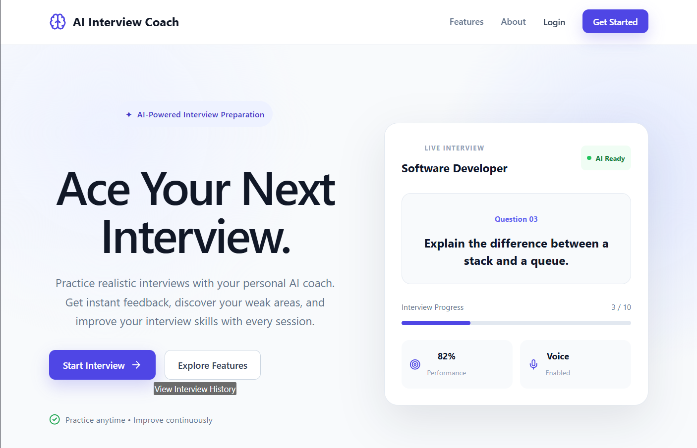

# AI Interview Coach

An AI-powered interview practice platform that helps users prepare for technical and HR interviews through interactive questions, answer evaluation, and interview history.

## Features

- Interactive interview setup
- Multiple target roles and experience levels
- Technical, HR, and mixed interview modes
- Customizable number of interview questions
- AI-style answer evaluation
- Relevance, clarity, technical accuracy, and communication scores
- Overall interview score
- Interview history dashboard
- Detailed review of previous answers
- Responsive design for desktop and mobile
- Local browser storage for interview history

## Tech Stack

### Frontend
- React
- Vite
- JavaScript
- CSS
- Lucide React

### Backend
- Node.js
- Express.js
- REST API
- CORS
- dotenv

### Data & Storage
- Browser Local Storage

### Development Tools
- VS Code
- Git
- GitHub

## Project Structure

```text
AI-Interview-Coach/
├── ai/
├── backend/
├── database/
├── docs/
├── frontend/
└── README.md

## How to Run

### 1. Clone the repository

```bash
git clone https://github.com/earlepallavi2007-gif/AI-Interview-Coach.git
cd AI-Interview-Coach

## Project Status

The core interview workflow is currently functional.

### Implemented
- Interview setup
- Interactive interview questions
- Answer submission
- Backend evaluation API
- Evaluation scores and feedback
- Interview completion
- Interview history
- Detailed interview review
- Responsive UI
- GitHub version control

### Current Limitation

The current evaluation system uses a mock evaluation response rather than a live AI API. This allows the application to demonstrate the complete interview workflow without requiring an external API key or paid API credits.

## Screenshots

## Screenshots

### Landing Page



## Future Improvements

- Integrate a live AI evaluation model
- Generate dynamic interview questions
- Add user authentication
- Store interview data in a database
- Add performance analytics and progress tracking
- Add personalized interview recommendations

## Author

Built as a portfolio project to explore React, Node.js, REST APIs, and AI-powered interview workflows.

## License

This project is intended for educational and portfolio purposes.